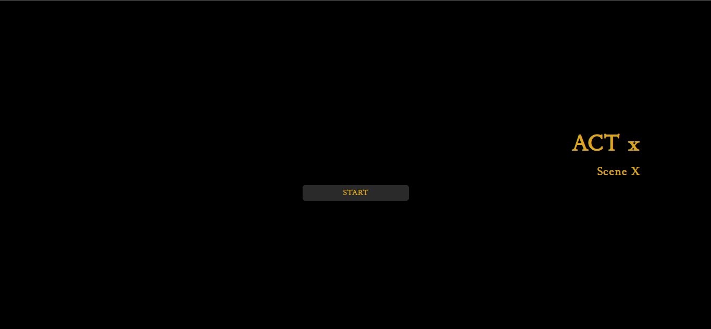
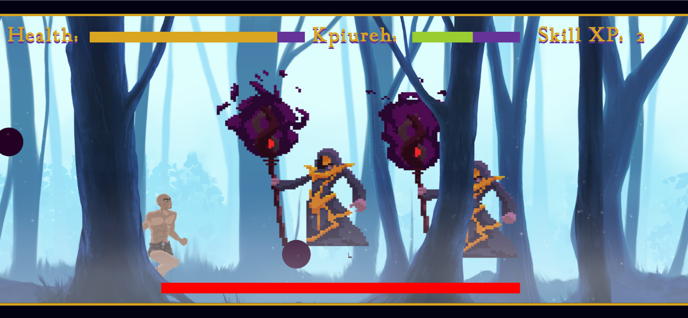
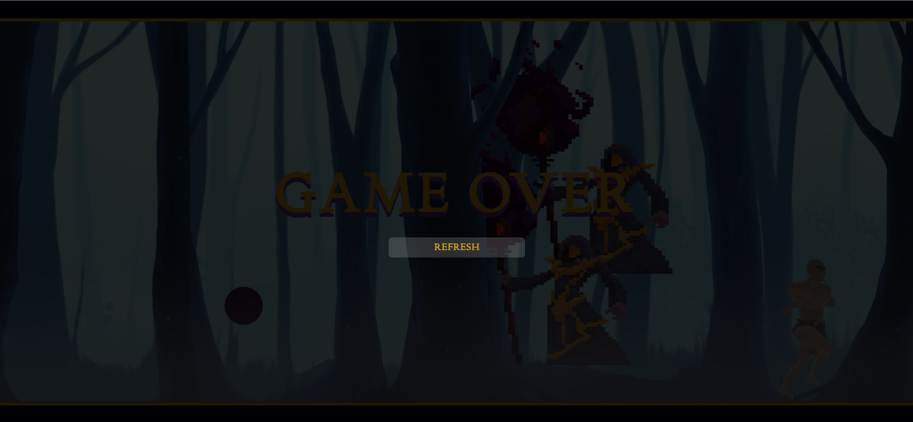

# WARLOCK

 

## Introduction

Warlock is a web-based, 2D, side-scrolling game written in Javascript for desktop browsers. It has its theme based on the world of "The Aged Era" by Stanley Aduaka. It is a fantasy adventure/epic series based loosely on Igbo mythology: A tale of spirits, oracles, gods and mortals; of their lives, lies, loves and lore.

Bits and interesting backstory of the journey to this product are detailed:
Here: [Landing Page](https://triremeideations.space/game) and an article [HERE](https://www.linkedin.com/pulse/gaming-aged-era-bringing-books-life-code-stanley-aduaka/)
It encompasses the challenges, thought process and miscellaneous engaging stuff.

The creator can be found here: [LinkedIn](https://www.linkedin.com/in/stanley-a-aa1669262/)

## Installation

There is no installation needed. The game is played in-browser.

## Usage and Controls

The user is to play the game using keyboard input of the Arrow Keys for movement, and the W, A, S and D keys for special moves which can be made in
combination with the arrow keys.

For mobile devices, a virtual keyboard has been implemented, and aims to be a means of availing almost similar control via touchscreen input. However, the best experience is to be obtained on a physical keyboard.

## Version

This is an alpha-version, and the first iteraion of the game.
It is the first ever deployment intended only for evaluation purposes.

## Screenshots

 

 

## Demo

WARLOCK ver 1.0 is [available here](https://triremeideations.space/in_house_test).

## Licence

All rights reserved. Permission to modify, update, replicate or use the contents of the repo for any purpose other than viewing is neither stated nor implied.
